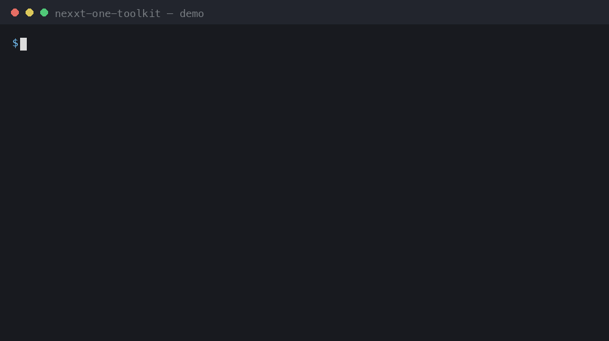

# nexxt-one-toolkit

[](https://github.com/VulcanusALex/nexxt-one-toolkit/actions/workflows/ci.yml)
[](LICENSE)
[](https://www.python.org)

Open-source toolkit for the **Fastweb NeXXt One** residential gateway
(Technicolor/Vantiva **FGA221D**, board **GDNT-S**, firmware branch `22.2.0378`),
covering compatibility probing, a non-destructive verification of the ping
diagnostic command-injection issue, reliable file transfer over that channel,
bootstrapping a **persistent key-only SSH service**, observing real inbound
traffic, auditing firewall/upgrade state, and producing sanitized support
bundles on a device **you own**.

Everything is pure **Python 3.9+ stdlib** — no dependencies to install.



> ⚠️ **Use only on your own device.** Every privileged step requires an
> authenticated web session, which requires pressing the physical buttons on
> the gateway. This is an owner-side toolkit, not a remote exploit — see
> [SECURITY.md](SECURITY.md).

## Quick start

```bash
git clone https://github.com/VulcanusALex/nexxt-one-toolkit.git
cd nexxt-one-toolkit

# Guided path: probe → physical-button login → harmless verification →
# local RSA key generation → confirmed persistent SSH. Shows the exact
# persistent change and asks before applying it.
./nexxt setup

# The generated private key is ~/.nexxt-one-toolkit/id_rsa
./nexxt doctor --key ~/.nexxt-one-toolkit/id_rsa
# Optional: explicitly contact api4/api6.ipify.org for public egress addresses
./nexxt doctor --key ~/.nexxt-one-toolkit/id_rsa --check-egress

# Idempotent, transactional firewall rule (firewall remains enabled)
./nexxt fw ensure --key ~/.nexxt-one-toolkit/id_rsa \
  --name Allow-AWG-v6 --proto udp --dest-ip 2001:db8::123 --dest-port 51820

# Start a new connection from outside during this window. A positive counter
# delta proves that traffic reached the gateway; zero is reported as unknown.
./nexxt inbound observe --key ~/.nexxt-one-toolkit/id_rsa \
  --rule Allow-AWG-v6 --wait 30

# Post-OTA/security audit and a safe issue attachment
./nexxt audit-update --key ~/.nexxt-one-toolkit/id_rsa
./nexxt support-bundle --key ~/.nexxt-one-toolkit/id_rsa

# Exact rollback: removes only toolkit-owned state and its own key
./nexxt ssh teardown
```

Install from PyPI (`pipx` recommended) or directly from a clone:

```bash
pipx install nexxt-one-toolkit
nexxt --help
```

## The toolkit

| Command | Purpose |
|---|---|
| `nexxt probe` | Unauthenticated, read-only compatibility check (safe first step) |
| `nexxt setup` | Guided, transactional path from probe to tested SSH; generates a compatible key locally |
| `nexxt doctor` | End-to-end health check with per-stage hints |
| `nexxt session` | Button-assisted login, HAR cookie import, read-only dump |
| `nexxt verify` | Non-persistent proof of command injection (timing probe + short-lived `/tmp` marker, cleaned up) |
| `nexxt transfer` | Reliable file transfer through the injection channel (segmented, content-filter-tolerant, oracle-verified) |
| `nexxt ssh` | Non-destructive **bootstrap / status / run / teardown** with persistent ownership records and exact key rollback |
| `nexxt fw` | Precise pinholes plus idempotent `ensure` and runtime `audit` — firewall stays ON |
| `nexxt inbound observe` | Watch a named firewall rule during a fresh external connection; never mistakes no observation for proof of blocking |
| `nexxt audit-update` | Post-OTA audit of fingerprint, SSH policy, rollback state and firewall runtime |
| `nexxt support-bundle` | Issue-ready ZIP/JSON with a strict field allowlist and automatic redaction |
| `nexxt wanwatch` | Cron-friendly watcher: detects when the ISP finally assigns a public IPv4 / the 6rd prefix changes |

Legacy entry points (`tools/nexxt_probe.py`, `tools/nexxt_session.py`, …) still
work and forward to the unified CLI.

Global flags: `--json` (machine-readable), `--quiet`, `--force` (skip the
firmware fingerprint guard), `--version`.

Docs:

- [docs/quickstart.md](docs/quickstart.md) — step-by-step illustrated quickstart (EN, start here)
- [docs/root-guide.md](docs/root-guide.md) — full technical guide (EN)
- [docs/quickstart.zh-CN.md](docs/quickstart.zh-CN.md) — 新用户逐步图文指南（推荐先读）
- [docs/root-guide.zh-CN.md](docs/root-guide.zh-CN.md) — 完整中文指南
- [docs/fastweb-notes.md](docs/fastweb-notes.md) — Fastweb network findings (EN) / [中文版](docs/fastweb-notes.zh-CN.md)
  (private WAN, upstream NAT/1:1 NAT, 6rd, inbound evidence) and how to talk to support

## Verified on

- NeXXt One `FGA221DFWB` / `GDNT-S`, firmware `22.2.0378_FW_058_FGA221D`
  (community report covers FW_056; the issue persists on FW_058).
  Other firmware? Please open a
  [compatibility report](https://github.com/VulcanusALex/nexxt-one-toolkit/issues/new?template=compatibility_report.md).

## Safety model

- No third-party code is ever downloaded to the router; everything is
  generated locally and transferred as data.
- No password changes, no firmware flashing, no TR-069 changes, no boot-bank
  changes.
- The SSH instance is key-only, password auth disabled, LAN high port only.
- Existing authorized keys are preserved. The toolkit records only its own key
  and original root account line in a root-only persistent state directory.
- `teardown` removes only toolkit-owned state and restores the recorded shell.
- Upgrading an installation made by v1.4.0 or older requires the explicit
  `--adopt-legacy` migration flag; the tool refuses to guess ownership.

## 中文摘要

本项目是 Fastweb NeXXt One 网关（FGA221D / GDNT-S）的开源工具箱：只读兼容性探测、
Ping 诊断命令注入的无持久化验证、经该通道的可靠文件传输、一键部署
**持久化、仅密钥、仅 LAN** 的 SSH 服务（可随时 teardown 完全还原）、
精确防火墙管理、真实入站计数观察、OTA 后安全审计、脱敏支持包与 WAN 状态监控。
统一入口 `./nexxt`；新用户可直接运行 `./nexxt setup`，已有用户用
`./nexxt doctor`、`fw audit` 和 `audit-update` 体检。
新用户建议从 [docs/quickstart.zh-CN.md](docs/quickstart.zh-CN.md)（逐步图文）开始。
**仅限用于你自己的设备**。完整中文文档见
[docs/root-guide.zh-CN.md](docs/root-guide.zh-CN.md)。

## Sintesi italiana

Toolkit open-source per il gateway **Fastweb NeXXt One** (FGA221D / GDNT-S):
sondaggio di compatibilità in sola lettura, verifica non distruttiva della
command injection nel diagnostico ping, trasferimento file affidabile tramite
quel canale, e installazione di un servizio **SSH persistente, solo-chiave,
solo-LAN** (con `teardown` per il ripristino completo), gestione di regole
firewall precise e idempotenti, verifica del traffico in ingresso, audit dopo
gli aggiornamenti e report di supporto anonimizzati. `./nexxt setup` guida il
login con i due pulsanti, la verifica e l'installazione; `./nexxt doctor`
mostra subito cosa manca. **Da usare solo sul proprio dispositivo.**
Guida completa (inglese): [docs/root-guide.md](docs/root-guide.md).

## License

MIT — see [LICENSE](LICENSE).
