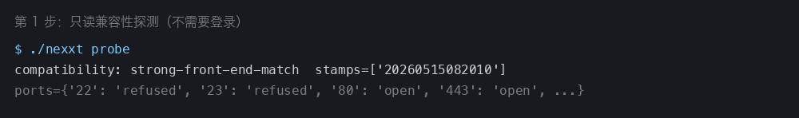
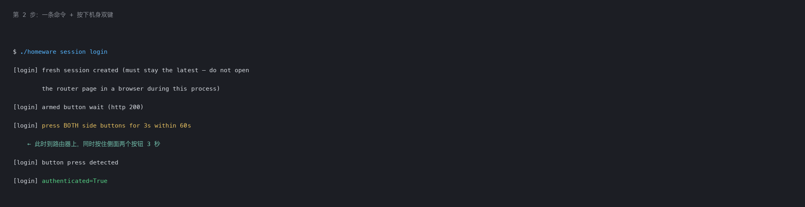
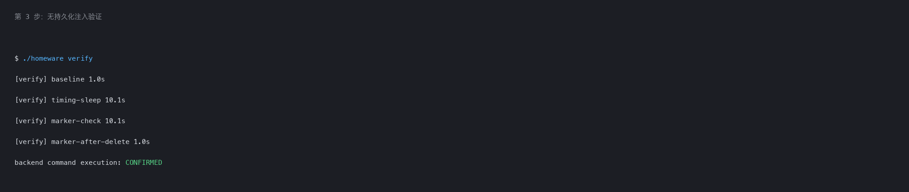
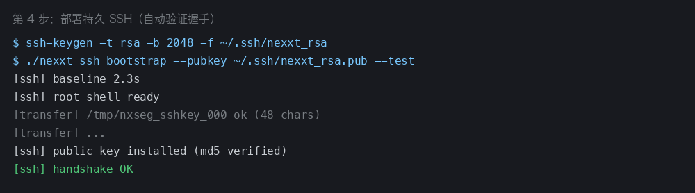
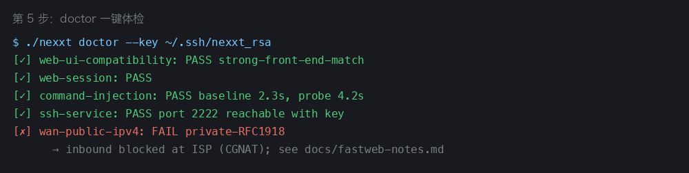

# 新用户逐步图文指南：从零到持久 SSH

> 适用设备：Fastweb **NeXXt One**（FGA221D / GDNT-S，固件 22.2.0378 系列）。
> 全程约 10 分钟。除了一次按机身按钮，所有操作都在电脑终端里完成。
> **仅限用于你自己的路由器。**

## 准备

- 一台和 NeXXt 在同一局域网的电脑（macOS / Linux / Windows WSL 均可）；
- Python 3.9 以上（不需要装任何第三方库）；
- 下载本仓库：

```bash
git clone https://github.com/VulcanusALex/nexxt-one-toolkit.git
cd nexxt-one-toolkit
```

> 后文所有 `./nexxt` 命令都在仓库根目录执行。Windows 原生 cmd 请用
> `python nexxt_toolkit/cli.py` 替代（或直接用 WSL）。

也可用 `pipx install nexxt-one-toolkit` 安装同一个 CLI，或从最新 GitHub
Release 下载独立 `nexxt.pyz` 和 `SHA256SUMS`；README 提供了校验和运行命令。
使用已安装的版本时，把下文 `./nexxt` 换成 `nexxt`；使用 zipapp 时换成
`./nexxt.pyz`。

## 推荐：一条命令完成安全部署

下面这条命令会依次完成后文的探测、按键登录、无害验证、本地 RSA 密钥生成、
持久变更确认和 SSH 握手验证；最后握手失败时会自动精确回滚：

```bash
./nexxt setup
```

希望逐步检查时，再按下面的手动流程执行。

## 第 1 步：只读探测（30 秒，零风险）

不登录、不改任何东西，确认你的设备兼容：



看到 `strong-front-end-match` 就可以继续。如果是 `incomplete-match`，说明固件
不一样——请先提一个 [compatibility issue](https://github.com/VulcanusALex/nexxt-one-toolkit/issues/new?template=compatibility_report.md)，不要强行继续。

## 第 2 步：按键登录（1 分钟）

NeXXt 没有密码登录，登录就是**同时按住机身侧面两个按钮 3 秒**。
现在只需要跑一条命令，等提示出现再去按：



> ⚠️ 两个注意点：
> 1. 提示出现后的 60 秒内完成按键；
> 2. **期间不要在浏览器里打开路由器页面**（浏览器会话会"顶掉"脚本的会话，
>    原理见 [root-guide.zh-CN.md §2](root-guide.zh-CN.md)）。

看到 `authenticated=True` 即登录成功，会话会保存在本地 `.work/` 目录供后续命令使用。

> 备用方案：如果你更习惯浏览器——先在浏览器登录路由器页面，然后把 Cookie 里的
> `sessionID` 值（或整个 HAR 导出文件）交给工具：
> `./nexxt session import-cookie <sessionID值或har文件路径>`

## 第 3 步：验证注入能力（1 分钟，无持久改动）

这一步只做无害探测（一次 sleep 时序 + 一个随即删除的 /tmp 标记文件），
确认后端命令执行通道可用：



看到 `CONFIRMED` 继续；看到 `NOT CONFIRMED` 说明该固件已修复注入，本工具箱的
SSH 部署将不可用（只读功能仍可用）。

## 第 4 步：部署持久 SSH（约 5 分钟）

先生成一把 **RSA** 密钥（注意：路由器的 dropbear 是 2019 年的版本，
**不支持 ed25519**），然后一键部署：



工具会自动：把 root 原始账户行持久保存到 root-only 所有权目录 → 修正 shell →
只追加并记录自己的公钥（不覆盖既有密钥）→ 创建仅密钥、仅 LAN 的 dropbear 实例 →
重启服务 → **自动试握手**。

如果设备曾由 v1.4.0 或更早版本部署过，需要明确迁移一次：

```bash
./nexxt ssh bootstrap --pubkey ~/.ssh/nexxt_rsa.pub --test --adopt-legacy
```

没有这个参数时，工具遇到无所有权记录的旧 `dropbear.nx` 或已修改 shell 会拒绝覆盖。

看到 `handshake OK` 就可以连接了：

```bash
ssh -i ~/.ssh/nexxt_rsa -p 2222 \
  -o HostKeyAlgorithms=+ssh-rsa -o PubkeyAcceptedKeyTypes=+ssh-rsa \
  root@192.168.1.254
```

> 想先看看会执行什么再决定？加 `--dry-run`：`./nexxt ssh bootstrap --pubkey ... --dry-run`

## 第 5 步：随时体检（5 秒）

以后任何时候，一条命令告诉你整条链路哪一步好/坏/缺：



- 全绿：一切就绪；
- 某步 FAIL：后面跟着的 `→` 会告诉你怎么修；
- `wan-ipv4-assignment: INFO private-RFC1918` 只描述 WAN 地址分配，**不能据此断定入站失败**。
  运营商可能提供上游 1:1 NAT；请用入站观察器取得实证。
- `doctor --check-egress` 会在用户明确选择后访问 api4/api6.ipify.org，对比公网出口与 WAN；
  默认关闭，而且公网出口结果不能替代入站实测。

## 日常用法

```bash
./nexxt ssh run "ip6tables -L zone_wan_forward -nv" --key ~/.ssh/nexxt_rsa   # 在路由器上执行命令
./nexxt fw list --key ~/.ssh/nexxt_rsa                                       # 看放行规则
./nexxt fw ensure --key ~/.ssh/nexxt_rsa --name Allow-AWG-v6 \
  --proto udp --dest-ip 2001:db8::123 --dest-port 51820                      # 幂等精确放行
./nexxt fw audit --key ~/.ssh/nexxt_rsa                                      # UCI/运行态安全审计
./nexxt inbound observe --key ~/.ssh/nexxt_rsa --rule Allow-AWG-v6 --wait 30 # 窗口内从外网新建连接
./nexxt audit-update --key ~/.ssh/nexxt_rsa                                  # OTA 或配置变化后审计
./nexxt support-bundle --key ~/.ssh/nexxt_rsa                                # 生成脱敏 issue 附件
./nexxt wanwatch --key ~/.ssh/nexxt_rsa                                      # 监视运营商是否下发了公网 IPv4
```

## 完全还原

```bash
./nexxt ssh teardown    # 只删除本工具拥有的状态/密钥，并恢复记录的 root 原始行
```

## 常见错误速查

| 现象 | 原因与处理 |
|---|---|
| 按键后 `authenticated=False` | 按键超时 / 期间打开了浏览器页面；重跑 `./nexxt session login` |
| `not authenticated` (exit 3) | 会话过期或被顶掉；重新 `./nexxt session login` |
| `UnknownDeviceError` | 固件指纹不识别；先跑 `./nexxt probe` 核对，确实要强行继续再加 `--force` |
| bootstrap 后握手被拒 | 密钥不是 RSA；必须 `ssh-keygen -t rsa` |
| `no matching host key type found` | Mac/新版 OpenSSH 需要加 `-o HostKeyAlgorithms=+ssh-rsa -o PubkeyAcceptedKeyTypes=+ssh-rsa` |
| `verify` 显示 NOT CONFIRMED | 该固件已修补注入；只有只读功能可用 |
| 提示旧修改没有所有权记录 | 存在 v1.4.0 或更早安装；仅在确认由本工具创建时加一次 `--adopt-legacy` |
| 入站观察结果为 `not-observed` | 结论未知，不等于阻断；从外网新建连接再测，硬件快转或上游过滤都可能导致零增量 |

## 下一步

- 完整原理与机制：[root-guide.zh-CN.md](root-guide.zh-CN.md)
- 运营商网络侧（CGNAT/6rd）调查：[fastweb-notes.zh-CN.md](fastweb-notes.zh-CN.md)
- 英文版指南：[root-guide.md](root-guide.md)
